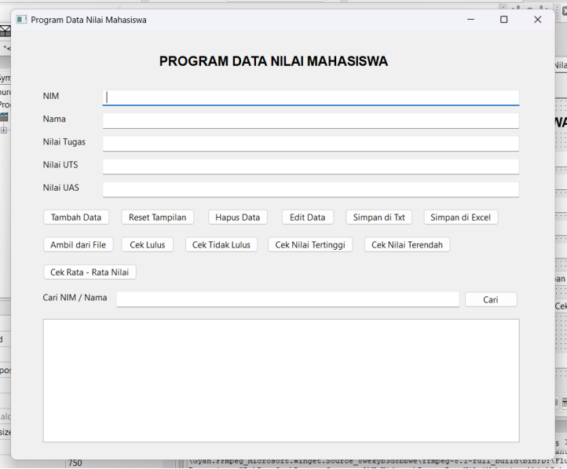
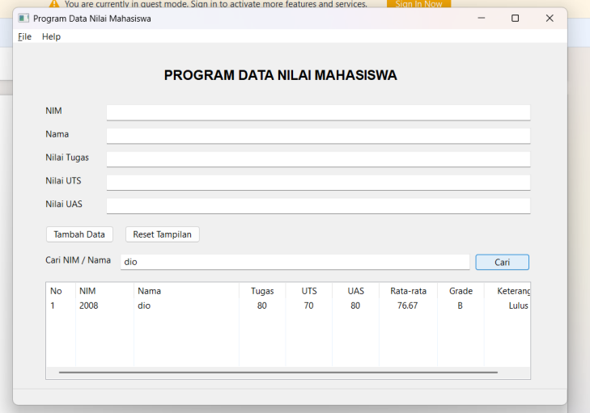
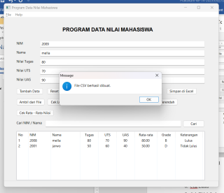
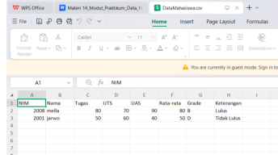

# 🎓 Student Grade Management System

A desktop application developed using **C++** and **wxWidgets** to manage student grades efficiently. The application provides features for managing student records, calculating grades automatically, searching data, sorting records, and importing/exporting files.

---

## 📷 Application Preview



---

## ✨ Features

- ➕ Add student records
- ✏️ Edit student information
- 🗑 Delete student records
- 🔍 Search by Student ID (NIM) or Name
- 📊 Automatic average score calculation
- 🏆 Automatic grade classification (A–E)
- ✅ Pass / Fail determination
- 📂 Import data from TXT and CSV files
- 💾 Export data to TXT
- 📄 Export data to CSV (Excel compatible)
- 📈 Display highest score
- 📉 Display lowest score
- 📋 Sort students by average score

---

## 🛠 Built With

- C++
- wxWidgets
- Code::Blocks
- wxSmith GUI Builder
- STL (Vector)

---

## 📂 Project Structure

```text
cpp-student-grade-management/
│
├── assets/
│   ├── main-window.png
│   ├── add-data.png
│   └── search.png
│
├── src/
├── include/
├── StudentGradeManagement.cbp
├── README.md
└── LICENSE
```

---

## 🚀 How to Build

### Requirements

- Code::Blocks
- wxWidgets
- GCC / MinGW

Open the project file:

```
StudentGradeManagement.cbp
```

Click **Build & Run**.

---

## 💡 Application Workflow

1. Enter Student ID (NIM)
2. Enter Student Name
3. Input Assignment, Midterm, and Final Exam scores
4. Click **Add Data**
5. The application automatically:

- Calculates average score
- Determines grade
- Determines pass/fail status
- Displays data in the table

Users can also:

- Search students
- Edit data
- Delete data
- Export TXT
- Export CSV
- Import TXT / CSV
- View highest score
- View lowest score
- Sort by average score

---

## 📸 Screenshots

### Main Window


### Search Feature



### Export CSV





---

## 📖 Concepts Implemented

- Object-Oriented Programming (C++)
- Event-Driven Programming
- GUI Development
- Data Validation
- Sequential Search
- Sorting
- File Handling
- STL Vector
- CRUD Operations

---

## 👨‍💻 Author

**Damar Azky**

Information Systems Student

GitHub:
https://github.com/damarazky

---

## 📄 License

This project is released under the MIT License.